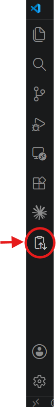
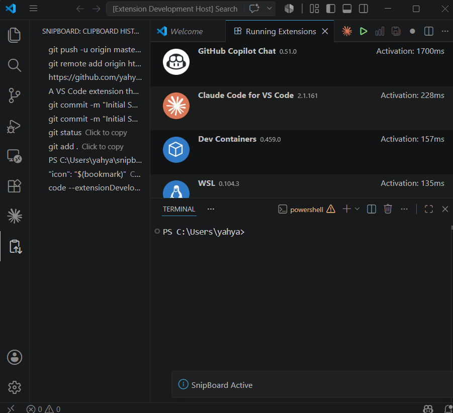

    # SnipBoard

A Visual Studio Code extension that automatically tracks clipboard history and provides quick access to reusable snippets through a dedicated sidebar.

## Features

* Automatically tracks clipboard history
* Stores unique snippets and removes duplicates
* Keeps the most recently copied items at the top
* Persistent storage across VS Code sessions
* One-click snippet copying
* Dedicated sidebar for quick access
* Lightweight and developer-focused

## Use Cases

SnipBoard is useful for storing and reusing:

* Terminal commands
* SSH connection strings
* Build commands
* Git commands
* Docker commands
* File paths
* Configuration snippets
* Frequently used code fragments

## Screenshots

| Sidebar                      | Clipboard History                      |
| ---------------------------- | -------------------------------------- |
|  |  |

## How It Works

1. Copy text anywhere on your system.
2. SnipBoard automatically detects new clipboard content.
3. Unique entries are added to the sidebar.
4. Click any snippet to instantly copy it back to the clipboard.
5. Frequently used snippets remain available across VS Code sessions.

## Built With

* TypeScript
* Visual Studio Code Extension API
* ESBuild

<<<<<<< HEAD
=======

**Enjoy!**
 
